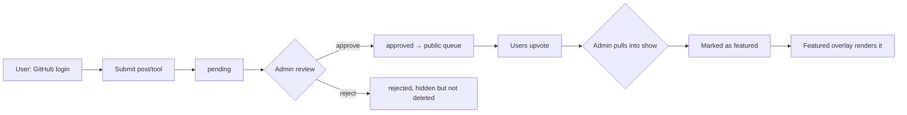

# Pole — Feature Plan

A live-stream overlay app for the show. Three devs share projects, the audience submits a fourth, votes on tools, and plays a Family-Feud-style game.

Stack: SvelteKit, Jazz Tools 2.0 (realtime, local-first), GitHub OAuth via better-auth.

---

## 1. Surfaces

One audience surface, one admin control surface, and multiple feature-owned OBS overlays, all reading the same Jazz-backed data.

```
┌─────────────────────────┐  ┌─────────────────────────┐  ┌─────────────────────────┐
│  /overlay/<feature>     │  │    / and /show/[id]     │  │       /admin            │
│   OBS browser sources   │  │  audience on phones/    │  │  show controls, gates,  │
│   read-only, transparent│  │  laptops                │  │  moderation, overlay    │
│   one URL per feature   │  │  view + submit + vote   │  │  state, raw data        │
└─────────────────────────┘  └─────────────────────────┘  └─────────────────────────┘
```

`/overlay/*`, `/`, and `/show/[id]` are publicly readable.
GitHub login is required to submit, vote, answer Feud prompts, or access `/admin`.

---

## 2. Roles

- **user** — signed-in audience member; submits, votes, answers Feud prompts
- **admin** — show operator/host; full data access, show controls, moderation, overlay state, raw Feud answer and bucket data

Unauthenticated visitors can view public live/ended show pages and public overlays, but cannot take actions.

Admin status comes from the signed Jazz session claim generated from `ADMIN_GITHUB_USER_IDS`. There is no separate host role; show hosts are admins.

---

## 3. Show as a resource

A **show** is one stream episode with its own ID, accessible at any time.

- `/show/[id]` — that show's audience page (live or archived)
- `/` — current show audience page
- `/admin/shows/[id]` — admin runs/edits it with full data access
- `/admin` — current show admin controls
- `/overlay/lower-thirds` — OBS lower-thirds overlay for the current show
- `/overlay/ticker` — OBS ticker overlay for the current show
- `/overlay/featured-submission` — OBS featured audience submission overlay for the current show
- `/overlay/tool-vote` — OBS tool vote/result overlay for the current show
- `/overlay/feud-collect` — OBS Feud collection prompt overlay for the current show
- `/overlay/feud-board` — OBS Feud board overlay for the current show

### Current show resolution

The current show is the `live` or `ended` show with the latest `startsAt` value. Draft shows are never current. `startsAt` is required; ties resolve by latest creation time, then ID for deterministic ordering.

`/`, `/admin`, and all `/overlay/<feature>` routes resolve through that rule. If no live or ended show exists, audience and admin current-show views render a no-show state, and overlays render nothing.

### Status

```
draft → live → ended
```

All transitions reversible. Nothing is destructive — `ended` shows can be reopened to `live`, etc.

| Action              | draft | live | ended |
| ------------------- | ----- | ---- | ----- |
| View show data      | admin | ✓    | ✓     |
| Submit posts/tools  | ✗     | ✓¹   | ✗     |
| Vote on submissions | ✗     | ✓¹   | ✗     |
| Submit Feud answers | ✗     | ✓²   | ✗     |
| Vote tool-of-stream | ✗     | ✓³   | ✗     |

¹ gated by show-level `audienceSubmissionsOpen` flag
² gated by per-question `collectionOpen` flag
³ gated by tool vote `pollOpen` flag

Submissions target a **specific show** — they can only be made while it's live.

When someone arrives after a show has ended, they see the results for everything:

- show host project/tool picks
- audience pick winner
- tool-of-stream vote results
- Feud board, revealed answers, and final host strike counts
- approved audience submissions featured during the show

Ended views render static results from the final show records.

---

## 4. Feature overlays

The producer decides which overlay is visible in OBS. The app does not own the live rundown or program state.

Each feature with an OBS presence owns its own overlay route and component. Overlays are transparent, read-only, and safe for a public browser source.

| Overlay route                  | OBS source shows                                | Controlled by                      |
| ------------------------------ | ----------------------------------------------- | ---------------------------------- |
| `/overlay/lower-thirds`        | show host lower third                           | admin selected lower-third state   |
| `/overlay/ticker`              | scrolling ticker items                          | admin ticker state                 |
| `/overlay/featured-submission` | approved/featured audience project or tool      | admin featured submission state    |
| `/overlay/tool-vote`           | tool poll live results or winner                | tool poll state                    |
| `/overlay/feud-collect`        | Feud prompt, no raw answers                     | Feud collection flag               |
| `/overlay/feud-board`          | Feud board, revealed slots, strikes, turn state | safe Feud board and strike records |

Overlay routes resolve to the current show. They do not include a show ID because OBS sources should stay stable across episodes.

An overlay may render nothing when its feature has no public state to show. OBS scene selection, ordering, sizing, and transitions remain producer-owned.

---

## 5. Audience submissions

Signed-in users submit posts and tools while the show is live and `audienceSubmissionsOpen=true`.

This gate is independent from OBS scene selection because submissions should open and close on the operator's timing. For example, submissions may open early in the show, then close before the audience-submitted pick is presented.

Each signed-in user gets one submission per show. They can edit or replace their own submission while `audienceSubmissionsOpen=true`; after the gate closes, moderation can still approve/reject it, but the user cannot keep changing it.



Moderation states: `pending | approved | rejected`. All reversible.

Moderation tools:

- one submission per user per show
- approve/reject submissions
- ban a user from submitting/voting

---

## 6. Tool of the stream

4 tool candidates per show:

- 3 prefilled by hosts as links on a per-host prep page
- 1 = top-voted audience-submitted tool, locked at the "lock audience pick" moment (reversible)

```mermaid
flowchart LR
  A[Admins prefill host tools ahead of show] --> B[Show goes live]
  B --> C[Audience submits + votes tool candidates]
  C --> D[Admin clicks 'lock audience pick']
  D --> E[4th candidate locked]
  E --> F[Producer shows featured audience pick overlay]
  F --> G[Admin opens tool poll]
  G --> H[Users vote favorite of the 4]
  H --> I[Admin closes poll → tool vote overlay shows winner]
```



One vote per user, replaceable until poll closes. Poll close is reversible.

---

## 7. Family-Feud-like game

Not standard Feud — adapted for our format:

- **3 teams**, one per show host
- **1 question total**
- Top-N answer groups become the board (default 6, per-question override)
- Show hosts compete to call out the top answers
- Strikes are per-host, not shared across the group

### Phases

```
collecting → locked → revealing → done
```

All reversible.

### Feud data visibility

Raw answer data is admin-only. Since show hosts are admins, game integrity is an operational trust rule rather than a separate permission tier.

1. Admin pre-seeds canonical buckets when creating the question (optional)
2. As users type, silent autocomplete suggests existing buckets — counts hidden
3. On lock: normalization sweeps stragglers into existing buckets
4. Top-N by count = the board; appears only after lock
5. Post-hoc admin merge tool, available after the game ends, for the recap

Admins can inspect and adjust the bucketed board. Public pages and overlays must only read safe Feud projections: prompt, phase, revealed slots, strikes, turn state, and final public results.

LLM-assisted semantic equivalence (`React` ≡ `ReactJS` ≡ `react.js`) is v2. v1 uses normalization + edit-distance.

### Per-question knobs

- `boardSize` (default 6, override allowed)
- `similarityMode` (strict / normal / loose)
- `preSeededBuckets` (optional)
- `collectionOpen` flag (admin-toggled, independent of phase)

### Open Feud rules

Resolved for v1:

- one Feud question per show
- Feud turn order is randomized per show
- strikes are tracked per host
- answer slots are revealed by admin controls

The randomized host order determines who gets the first guess.

---

## 8. Visibility flags

Independent admin-toggled flags on the show / question. Audience controls appear only when the relevant flag is true.

- `show.audienceSubmissionsOpen` → post/tool form visible
- `feudQuestion.collectionOpen` → Feud answer form visible
- `toolPoll.pollOpen` → tool-of-stream vote UI visible

Flags can overlap. Closing one hides only that audience control.

Flags are independent of OBS scenes — admins can flip them any time, including reopening after closing.

---

## 9. Reversibility principle

No hard deletes. No one-way state. Every status, flag, vote-close, lock, reveal, reject is toggleable.

| Action             | Reversal                                      |
| ------------------ | --------------------------------------------- |
| End show           | Reopen → status back to live                  |
| Lock Feud          | Unlock → back to collecting, board recomputes |
| Reveal slot        | Un-reveal                                     |
| Reject submission  | Un-reject (back to pending or approved)       |
| Ban user           | Unban by clearing the user ban flag           |
| Lock audience pick | Unlock, vote re-opens                         |
| Close tool poll    | Reopen                                        |

---

## 10. State location

All shared / coordinated state lives in Jazz tables. Anything one user does that another user must see is in the DB.

Form drafts live in plain HTML (uncontrolled inputs) until submit. No draft-saving, no controlled state for form fields.

UI ephemera (modal open, hover, scroll position) is local component state.

---

## 11. Show Control UX Shape

Persistent panels in `/admin/shows/[id]`:

```
┌──────────────┬───────────────────────────────────────────────────────┐
│ SHOW STATE   │  FEATURE WORKSPACES                                   │
│              │                                                       │
│ status       │  lower thirds · ticker · featured submission          │
│ gates        │  tool vote · Feud collect · Feud board                │
│ OBS URLs     │  + iframe preview for selected overlay                 │
├──────────────┼───────────────────────────────────────────────────────┤
│ QUEUE        │  pending · approved · featured (filterable)           │
└──────────────┴───────────────────────────────────────────────────────┘
```

No app-owned rundown. The producer controls active scene selection in OBS. The app provides data controls, feature workspaces, and copyable OBS overlay URLs.

The admin surface can expose all Jazz records for a show, including raw Feud answers, bucket assignments, user moderation history, and overlay control state.

---

## 12. Overlay behavior

Each `/overlay/<feature>` route renders one feature-specific OBS overlay for the current show.

Rules:

- one feature per overlay route
- overlays are transparent and safe for OBS browser sources
- overlays are public read-only routes and must query public-safe projection data only
- no operator chrome, forms, moderation state, or raw Feud data render in overlays
- overlays render nothing or a stable idle state when their feature has no public state
- admin route changes are reflected live
- ended shows render static results where that feature has meaningful results
- audience and overlay routes never expose moderation state or raw Feud data

This means each overlay is deterministic: OBS chooses which feature is visible, and the overlay only reflects the current public state for that feature.

---

## 13. Design gates before implementation

These are now part of the v1 implementation contract:

- **Current show resolution** — `/`, `/admin`, and `/overlay/<feature>` all use the same latest live-or-ended `startsAt` rule.
- **Permissions matrix** — every action for user / admin must be known before wiring Jazz permissions.
- **Public overlay projections** — overlays must query public-safe data only, not broad admin records.
- **Concurrent controls** — every multi-admin control must have a conflict rule.
- **One-submission edits** — replacing a submission moves it back to pending.
- **Audience pick timing** — an admin lock action snapshots the current audience submission winner.

---

## 14. V1 implementation contract

Build one vertical slice at a time. Do not start a later slice until the current slice has the data model, permissions, route, and basic UI wired together.

1. **Show resource**
   - Create/read/update shows.
   - Implement `/show/[id]`, `/admin/shows/[id]`, and the first feature overlay route.
   - Keep `/`, `/admin`, and `/overlay/<feature>` as current show views.
2. **Overlay foundation**
   - Add the feature-owned overlay route pattern.
   - Add shared current show resolution for `/`, `/admin`, and `/overlay/<feature>` routes.
   - Add transparent OBS-safe layout defaults.
   - Add admin copyable OBS URLs.
3. **Admin show controls**
   - Show status controls.
   - Visibility gate controls.
   - Feature workspaces.
   - Selected overlay iframe preview.
   - Submission queue region.
   - OBS URL list.
4. **User submissions**
   - One submission per signed-in user per show.
   - Submit/edit only while show is `live` and `audienceSubmissionsOpen=true`.
   - Admin moderation can continue after the gate closes.
   - Featured submission overlay renders the currently featured approved submission.
5. **Audience pick + tool vote**
   - Lock the top approved audience-submitted tool as the fourth tool candidate.
   - Open/close the tool poll independently from OBS scene selection.
   - One replaceable vote per signed-in user until the poll closes.
   - Tool vote overlay renders live results while open and the winner when closed.
6. **Feud collect**
   - One question per show.
   - Signed-in users submit one answer while show is `live` and `collectionOpen=true`.
   - Feud collect overlay renders the prompt only.
7. **Feud game**
   - Lock question.
   - Build board from bucket snapshots.
   - Reveal/unreveal slots.
   - Track strikes per host.
   - Feud board overlay renders safe board slots, revealed answers, strikes, and turn state.
   - Preserve public overlay data boundaries at the data permission layer.

Do not implement v2 backlog items until these slices are complete.

---

## 15. Permissions matrix

Permissions must be enforced at the Jazz policy/query boundary, not only hidden in UI.

| Action                                | User | Admin | Notes                                               |
| ------------------------------------- | ---- | ----- | --------------------------------------------------- |
| Read live public show data            | ✓    | ✓     | Also public with no login; approved/public records. |
| Read draft show data                  | ✗    | ✓     | Drafts are private to admins.                       |
| Read ended show data                  | ✓    | ✓     | Also public with no login; static public results.   |
| Create show                           | ✗    | ✓     | Admin-only.                                         |
| Edit show metadata                    | ✗    | ✓     | Title, slug, startsAt, host lineup, links.          |
| Change show status                    | ✗    | ✓     | Admins run the show.                                |
| Toggle audience submissions           | ✗    | ✓     | Independent of OBS scene selection.                 |
| Create own submission                 | ✓    | ✓     | Only live + gate open + not banned.                 |
| Edit own submission                   | ✓    | ✓     | Only live + gate open + not banned.                 |
| Read own pending/rejected submission  | ✓    | ✓     | Users can see their own moderation state.           |
| Read all pending/rejected submissions | ✗    | ✓     | Moderation queue.                                   |
| Approve/reject submissions            | ✗    | ✓     | Reversible.                                         |
| Feature submission                    | ✗    | ✓     | Renders in the featured submission overlay.         |
| Vote on approved submissions          | ✓    | ✓     | Only live + gate open + not banned.                 |
| Ban/unban users                       | ✗    | ✓     | Ban state lives on `appUsers`.                      |
| Create/edit host links                | ✗    | ✓     | Per-host prep is links only.                        |
| Lock/unlock audience pick             | ✗    | ✓     | Defined below.                                      |
| Open/close tool poll                  | ✗    | ✓     | Reversible.                                         |
| Vote in tool poll                     | ✓    | ✓     | Only live + poll open + not banned.                 |
| Create/edit Feud question             | ✗    | ✓     | Admin-only because buckets can expose answers.      |
| Toggle Feud collection                | ✗    | ✓     | Gate only, does not expose answers.                 |
| Submit own Feud answer                | ✓    | ✓     | Only live + collection open + not banned.           |
| Read raw Feud answers                 | ✗    | ✓     | Admin-only.                                         |
| Read hidden Feud bucket counts        | ✗    | ✓     | Admin-only.                                         |
| Lock/unlock Feud board                | ✗    | ✓     | Locking performs normalization/bucketing.           |
| Reveal/unreveal Feud slot             | ✗    | ✓     | Revealed slots are safe public board records.       |
| Edit Feud buckets/merges              | ✗    | ✓     | Admin-only, post-hoc merge allowed after game.      |
| Update strikes                        | ✗    | ✓     | Per-host strike records.                            |
| Edit lower-thirds state               | ✗    | ✓     | Shape to be evaluated against `syntax-overlay`.     |
| Edit ticker state                     | ✗    | ✓     | Shape to be evaluated against `syntax-overlay`.     |

---

## 16. Public-safe data boundaries

Overlay and audience routes are public surfaces. They must query public-safe records/projections, not admin records with hidden moderation or raw game data.

**Public-safe records**

- show metadata for `live` and `ended` shows
- public overlay feature state
- approved/featured audience submissions
- tool candidates
- tool poll aggregate results
- revealed Feud answers
- Feud strikes

**Admin-only records**

- pending/rejected audience submissions for moderation
- raw Feud answers
- normalized Feud answers
- Feud answer-to-bucket assignments
- unrevealed bucket counts
- bucket merge internals
- user moderation history
- overlay control records that are not intended to render publicly
- admin/user management records

If an overlay or audience route needs a Feud board, it must query a safe board projection or revealed slot records. It must not query raw `feudAnswers` or unrevealed `feudBuckets`.

---

## 17. Concurrency rules

Realtime control conflicts should be boring and reversible.

- **Current show resolution:** derived from `status in ('live', 'ended')` sorted by latest `startsAt`, latest creation time, then ID. No operator writes directly to "current show."
- **Visibility flags:** latest accepted boolean write wins. Flags are reversible and independent.
- **Submission moderation:** latest accepted status write wins. Preserve `reviewedById` and `reviewedAt` for the latest moderation action.
- **Audience pick lock:** idempotent per show. Re-locking updates the locked candidate from the current top approved audience tool. Unlocking removes the locked audience candidate from the poll and reopens audience-submission voting.
- **Tool poll vote:** one record per `showId + voterId`. New vote replaces the prior candidate while the poll is open.
- **Feud answer submit:** one record per `questionId + authorId`. New answer replaces the prior answer while collection is open.
- **Feud lock:** admin-only. Lock recomputes the board from current submitted answers and bucket rules.
- **Feud unlock:** returns to collecting and clears generated board/revealed-slot state that depends on the prior lock. Raw submitted answers remain.
- **Feud reveal slot:** idempotent per `questionId + slotIndex`. Revealing an already revealed slot updates the same safe revealed-slot record.
- **Feud unreveal slot:** removes or marks hidden only the safe revealed-slot record. It must not modify raw answers or bucket counts.
- **Strikes:** latest accepted count wins per `questionId + hostId`.
- **Lower thirds and ticker:** default to latest accepted overlay-state snapshot wins unless the `syntax-overlay` reference evaluation shows a better per-item action model.

No hard deletes are user-facing. Internal cleanup for derived/recomputed records is allowed only when the source data remains intact and the action is reversible from the user's perspective.

---

## 18. Resolved decisions

### One-submission edits

Replacing a submission while the audience gate is open moves it back to `pending`.

Reason: if a user changes the URL/title/notes after approval, the new content needs moderation again. Admins can approve it again, and the prior moderation history remains visible through `reviewedById`/`reviewedAt` updates.

### Audience pick timing

The audience pick locks when an admin clicks **lock audience pick**.

That action:

- finds the current top approved audience submission where `kind='tool'`
- uses vote count as the primary sort
- uses earliest submission `createdAt` as the tie-breaker
- creates or updates the audience-sourced `toolCandidate` in position 4
- stores `audienceSubmissionId` and `lockedAt`
- sets `show.audienceSubmissionsOpen=false` so submissions and submission votes stop changing the locked pick

Unlocking reverses that:

- clears/removes the audience-sourced position-4 tool candidate from the poll
- clears the lock timestamp
- if the show is still `live`, sets `show.audienceSubmissionsOpen=true`
- allows the pick to be recomputed from current approved audience tool votes

Previously resolved:

- Feud turn order is randomized each show.
- Per-host prep is links only.
- Ended show view is static results only, no timeline.
- Ban state lives on the user object.
- The only roles are `user` and `admin`; show hosts are admins.

---

## 19. Backlog (v2+)

- Audience reactions (emoji bursts on stream)
- Per-host applause meters
- LLM-assisted Feud bucketing for semantic equivalence
- Scheduled show templates (recurring weekly)
- Cross-device draft sync for in-progress submissions
- Public show history / archive index
- OBS-signed stream URL if public scraping becomes a problem

## 20. Lower-thirds and ticker reference

Lower-thirds and ticker should be evaluated against `https://github.com/randyrektor/syntax-overlay` before finalizing their schema and admin controls.

Evaluation goals:

- decide whether each feature stores one full overlay-state snapshot or normalized per-item records
- preserve stable OBS URLs with operator-controlled state
- keep overlay routes public, read-only, and chrome-free
- reuse useful conventions from the reference app without copying its transport layer unless it still fits Jazz
